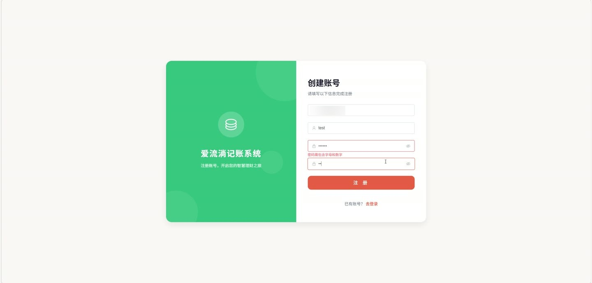
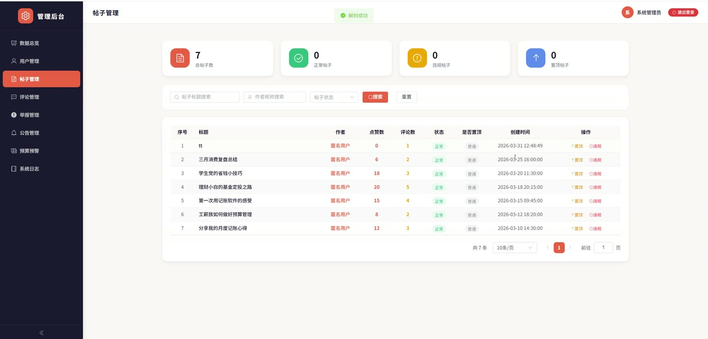
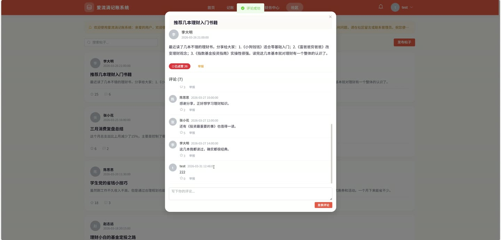
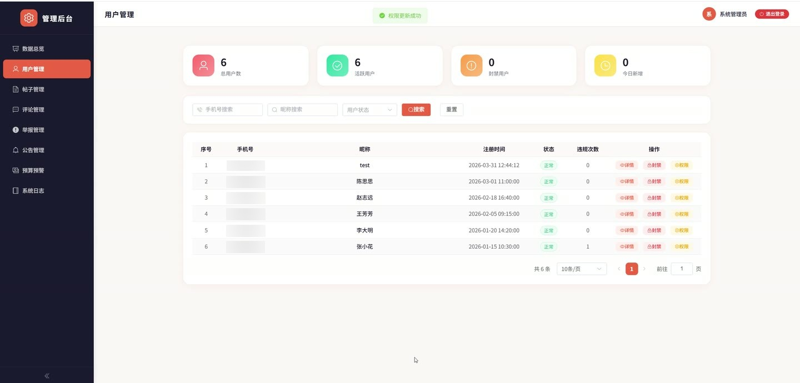

# (附文档)Springboot3+Vue3+MySQL 爱流淌记账系统

**技术栈**：Springboot3、Vue3、MySQL

### 系统简介

爱流淌记账系统是一套基于 Springboot3 + Vue3 前后端分离架构的记账与社区管理平台，包含普通用户和管理员两大角色。用户可进行日常记账、资产管理、理财计划、预算预警、社区互动等操作；管理员可对用户、帖子、评论、公告、轮播图、举报、系统日志等进行统一管理。
 
### 核心功能
 
### 普通用户端

 
- 账单管理：添加、修改、删除账单记录，支持按类型（支出/收入）、分类、日期范围分页查询账单列表。 
- 月度收支汇总：查看指定月份的收支汇总数据，快速了解月度财务状况。 
- 批量导入账单：通过上传 Excel 文件批量导入账单，系统自动解析日期、类型、分类、金额、备注字段。 
- 导出账单：将指定月份的账单数据导出为 Excel 文件，包含日期、类型、分类、金额、备注列。 
- 资产账户管理：添加、修改、删除资产账户（如现金、银行卡等），查看资产列表及资产总额。 
- 预算设置：为指定月份设置预算金额（新增或更新），查看预算列表及预算预警信息。 
- 理财计划：创建、更新、删除理财计划（目标金额、已存金额等），支持向计划中存入金额。 
- 账单分类管理：查看系统预置分类列表，可按类型筛选；添加/删除用户自定义分类。 
- 统计看板：查看支出分类统计（各分类金额及笔数）、收支趋势分析（按年/月/周/日维度）、支出对比分析（与上一周期对比）、支出排行。 
- 社区帖子：发布帖子、删除自己的帖子、分页浏览帖子列表（支持关键词搜索）、查看帖子详情。 
- 评论互动：发表评论（受禁言/评论权限控制）、删除自己的评论或自己帖子下的评论、查看帖子评论列表。 
- 点赞功能：对帖子或评论切换点赞/取消点赞，查询是否已点赞。 
- 举报功能：对违规帖子或评论发起举报，提交举报类型和说明。 
- 公告查看：查看社区公告列表及公告详情，查看个人收到的公告。 
- 轮播图与文章：查看首页启用的轮播图列表，查看轮播图关联的文章详情。 
- 消息中心：分页查看消息列表（按类型筛选）、标记单条或全部消息为已读、查看未读消息数量、删除单条或批量删除消息。 
- 个人中心：用户注册/登录、查看个人信息、更新昵称/头像等资料、注销账号。
 
### 管理员端

 
- 用户管理：分页查询用户列表（按手机号/昵称/状态筛选）、查看用户详情、启用/禁用用户、修改用户权限（发帖/评论/禁言时间）。 
- 帖子管理：分页查询帖子列表（按标题/用户/状态/置顶筛选）、设置/取消帖子置顶、标记/取消违规帖子、查看帖子统计数据。 
- 评论管理：分页查询评论列表（按帖子/用户筛选）、删除违规评论、标记/取消违规评论。 
- 公告管理：发布公告（指定类型/分类）、分页查询公告列表（按类型/分类筛选）、删除公告。 
- 轮播图管理：分页查询轮播图、添加/更新/删除轮播图。 
- 文章管理：分页查询文章列表（按关键词搜索）、查看/添加/更新/删除文章、获取已发布文章列表（用于轮播图关联）。 
- 举报管理：分页查询举报列表（按状态筛选）、处理举报（通过/驳回并填写备注）。 
- 预算预警：查看超出预算的用户列表（按月份筛选）。 
- 系统日志：分页查询系统操作日志（按用户名/操作类型/日期范围筛选）。
 
### 技术栈

 后端框架Spring Boot 3 ORMMyBatis-Plus 权限认证JWT Token（基于请求头 userId/userRole 属性） 前端框架Vue 3 状态管理Vuex / Pinia（由 Vue3 项目决定） 构建工具Vite 数据库MySQL 文件上传本地存储（支持 jpg/png/gif/bmp/webp） Excel 处理Apache POI
 
### 交付内容

 
- 后端完整源码 
- 前端完整源码 
- 数据库初始化脚本 
- 万字文档

## 界面展示

---

## 获取完整源码 + 万字文档

本仓库为项目介绍页。**完整前后端源码、数据库初始化脚本、万字项目文档**，请加微信 `kangkangcode`，或访问 [codekk.top](http://codekk.top) 获取。

可作课程设计 / 毕业设计参考，支持远程部署调试。